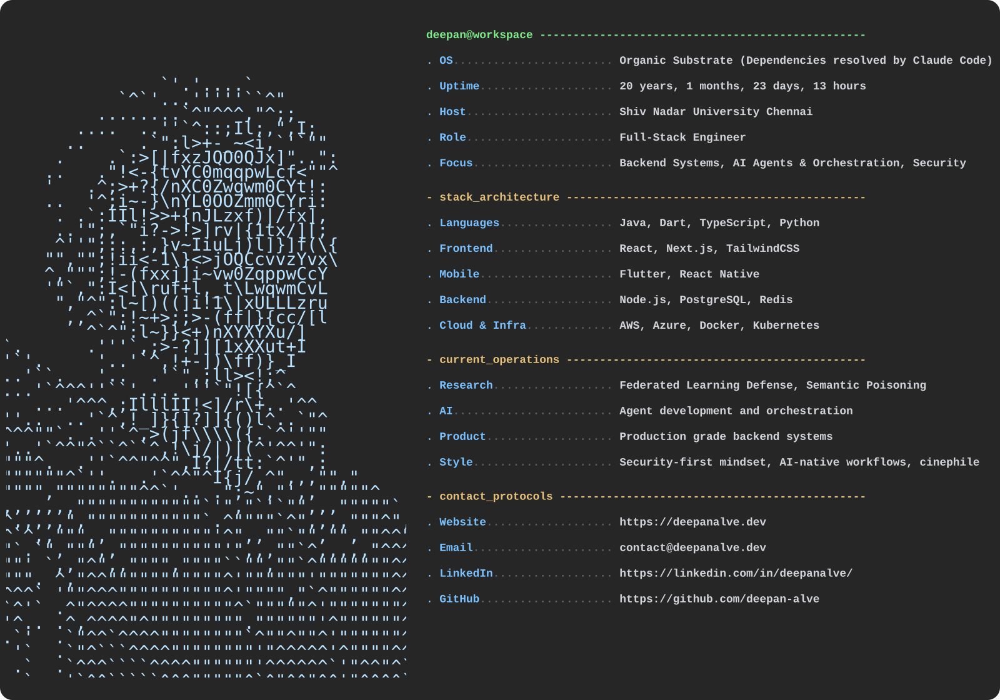

  

**`~$ whoami`**

Engineer building production software across **web**, **mobile**, **backend infrastructure**, and **applied AI**. Current focus: agent development, orchestration workflows, and federated learning defense research — with a strong bias toward systems that stay useful long after the prototype stage.

I like owning systems end-to-end: architecture, auth, access control, deployment, reliability, and the engineering decisions that make software hold up under real constraints.

**`~$ cat accolades.log`**

| | |
|:---:|:---|
| 🏆 | **CTF Edita — Winner.** Excellence in cybersecurity defense and offensive operations. |
| 🛡️ | **Hack The Box — Global Top 750.** Among the elite globally in penetration testing and adversarial research. |
| 💻 | **ICPC — Regional Participant.** Competed at the highest level of collegiate algorithmic problem-solving. |
| 🚀 | **HP CodeWars — National Top 30.** Finalist in the national enterprise coding performance challenge. |
