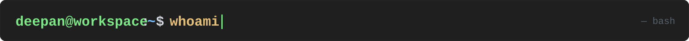
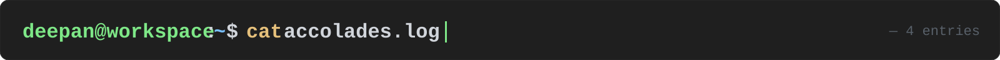

  

  

Engineer building production software across **web**, **mobile**, **backend infrastructure**, and **applied AI**. Current focus: agent development, orchestration workflows, and federated learning defense research — with a strong bias toward systems that stay useful long after the prototype stage.

I like owning systems end-to-end: architecture, auth, access control, deployment, reliability, and the engineering decisions that make software hold up under real constraints.

  

<table>
  <tr><td width="56" align="center">🏆</td><td><strong>CTF Edita — Winner.</strong> Excellence in cybersecurity defense and offensive operations.</td></tr>
  <tr><td align="center">🛡️</td><td><strong>Hack The Box — Global Top 750.</strong> Among the elite globally in penetration testing and adversarial research.</td></tr>
  <tr><td align="center">💻</td><td><strong>ICPC — Regional Participant.</strong> Competed at the highest level of collegiate algorithmic problem-solving.</td></tr>
  <tr><td align="center">🚀</td><td><strong>HP CodeWars — National Top 30.</strong> Finalist in the national enterprise coding performance challenge.</td></tr>
</table>
